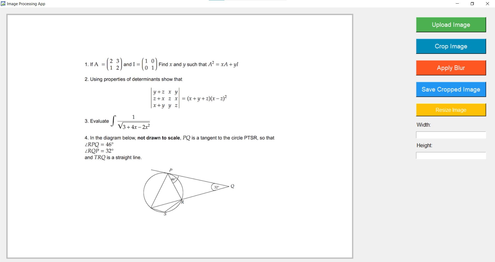

# ImageRefiner Desktop Application



## Table of Contents
- [Overview](#overview)
- [Features](#features)
- [Installation](#installation)
  - [Executable File](#executable-file)
  - [Installable File](#installable-file)
- [Usage](#usage)
- [License](#license)

## Overview
The ImageRefiner Desktop Application is a simple Python-based tool built using Tkinter and OpenCV for simple image processing tasks like cropping, blurring, and resizing images. It provides an intuitive interface for users to perform these operations effortlessly. The main purpose of this app is to illustrate how one can build a computer vision installable desktop application,

## Features
- **Upload Image:** Select and display images for processing.
- **Crop Image:** Define a specific area to crop the image.
- **Apply Blur:** Blur selected portions of the image interactively.
- **Save Cropped Image:** Save the cropped portion of the image.
- **Resize Image:** Change the dimensions of the image.


## Getting Started

### Prerequisites

- Python 3.x installed
- Required Python libraries: OpenCV, NumPy, Tkinter, Pillow, pyinstaller

### Installation

1. Clone the repository to your local machine:

   ```bash
   git clone https://github.com/george-mountain/ImageProcessor-DesktopApp.git
   ```

2. Install the required Python libraries:

   ```bash
   pip install opencv-python numpy pillow pyinstaller
   ```


### Executable File
To run the application using the standalone executable file:
1. Clone or download the repository.
2. Open a terminal or command prompt.
3. Navigate to the directory containing the cloned/downloaded files.
4. Use the following command:
    ```
    pyinstaller --onefile --windowed --icon=/path/to/icon_file.ico --name=ImageRefiner main.py
    ```
    Checkout the converter.txt file or the builder.sh file for the script on how to build the installer.
Please replace the "/path/to/icon_file.ico" above with your icon file path which should be in the .ico format
5. Locate the generated executable file in the `dist` directory.

### Installable File
To create an installable setup using Inno Setup:
1. Ensure Inno Setup is installed on your system.
2. Create a new `.iss` file or use the provided `.iss` file in this repo named "imageProcessor.iss".
3. Modify the `.iss` file as needed, setting up the application details, file paths, and configurations.
4. Compile the script using Inno Setup, generating an installer file.
5. Run the installer to install the ImageRefiner application.

Note: You need to install the Inno setup software. If you are using Windows OS, please download and install Inno setup from here [Inno Setup Download](https://jrsoftware.org/isdl.php).

**Note:** If you want to add a custom icon file on the app just as shown above, you might likely encounter some errors and warnings regarding virus and security threats. This error is mainly related to Windows Defender flagging the generated EXE file as potentially containing a virus or unwanted software. This is a common issue with some packers and obfuscators, including PyInstaller. In case you encountered the error, do not panic and follow the following steps:
1. **Exclude the Build Directory from Antivirus Scans:**
   Exclude the build directory from your antivirus software's real-time scanning. This is where PyInstaller creates temporary files during the build process.

2. **Temporarily Disable Antivirus:**
   Temporarily disable your antivirus software while running the PyInstaller command. Remember to re-enable it after the build is complete.

3. **Custom Icon Issues:**
   You might try building without the custom icon if you do not want to follow option 1 and 2 above.

#### Sample `.iss` code:
```iss
[Setup]
AppName=ImageRefiner
AppVersion=1.0
DefaultDirName={commonpf}\ImageRefiner
DefaultGroupName=ImageRefiner
OutputDir=Output
OutputBaseFilename=ImageRefinerSetup

[Files]
Source: "dist\ImageRefiner.exe"; DestDir: "{app}"
; Additional files or directories to be installed can be added here

[Tasks]
Name: "desktopicon"; Description: "Create a desktop icon"; GroupDescription: "Additional icons:"
Name: "desktopicon\uninstall"; Description: "Remove desktop icon during uninstallation"; GroupDescription: "Additional icons:"

[Icons]
Name: "{group}\ImageRefiner"; Filename: "{app}\ImageRefiner.exe"
Name: "{commondesktop}\ImageRefiner"; Filename: "{app}\ImageRefiner.exe"; Tasks: desktopicon


[UninstallDelete]
Type: filesandordirs; Name: "{commondesktop}\ImageRefiner.lnk"; Tasks: desktopicon\uninstall

```
Open the Inno Setup Software. Click on the new file menu, and select the .iss file (in our case: imageProcessor.iss) to upload. After uploading it, then click on the run executable
**Note:** The provided instructions assume a Windows environment for the executable and installer generation.
## Usage
1. **Run the Application:** Double-click the executable file or launch the installed application.
2. **Upload Image:** Click "Upload Image" to select an image for processing.
3. **Perform Actions:** Use buttons like "Crop Image," "Apply Blur," "Save Cropped Image," and "Resize Image" to perform respective actions on the uploaded image.
4. **Exit:** Close the application using the close button or the window close icon.

## License
This project is licensed under the [MIT License](https://opensource.org/license/mit/).

